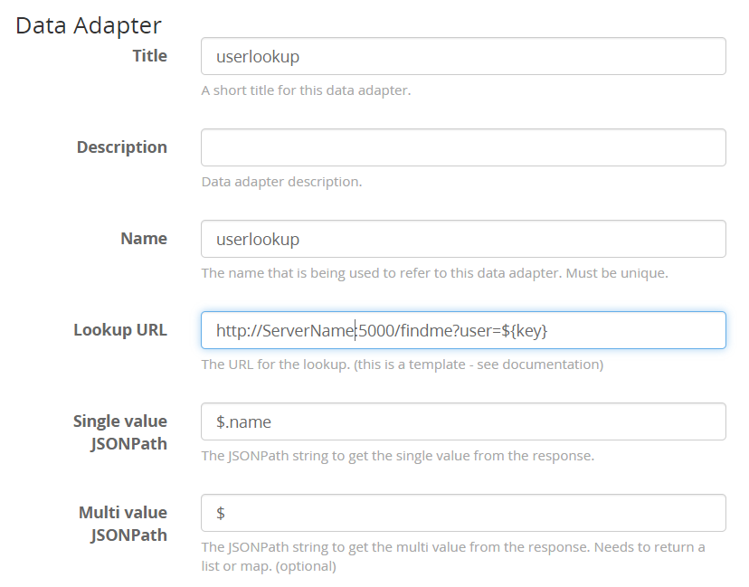

# API Tools

### Start-UserFind.ps1

This requires the polaris module.  It's available from the Powershell Gallery but its an ancient version - go get it from [the source](https://github.com/PowerShell/Polaris). 

You can also read more about it from its [project site](https://powershell.github.io/Polaris/docs/about_GettingStarted.html). 

Just run this script and leave it running.  Whatever you put in the hostname you should be able to access it from http://$hostName:5000/findme?user="query"

If you want to run it is as service - which I strongly suggest, then I **also** strongly suggest you use [NSSM](https://nssm.cc/) 

#### Setting it up in Graylog

Do this: 

